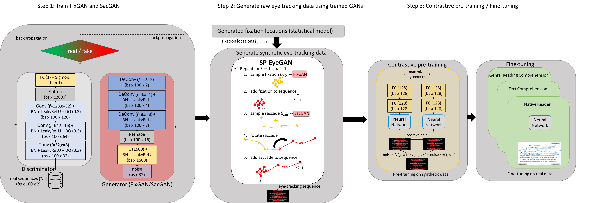

# SP-EyeGAN: Generating Synthetic Eye Movement Data                               
This repo provides the code for reproducing the experiments in SP-EyeGAN: Generating Synthetic Eye Movement Data.

## Reproduce the experiments

### Download data to extract fixations and saccades
* Download and extract the GazeBase data into a local directory to train FixGAN and SacGAN (https://figshare.com/articles/dataset/GazeBase_Data_Repository/12912257)

### Configure the paths
* modify `config.py` to contain the path to the GazeBase and SB-SAT directory and specify the folders, where you want to store the models and classification results.

### Pipeline to train FixGAN and SacGAN and to create synthtic data

To train generative models to create fixations and saccades follow the next steps.

#### 1. Create data to train FixGAN and SacGAN
Create the data containing fixations and saccades extracted from GazeBase by running:
    * `python create_event_data_from_gazebase.py`
    
#### 2. Train FixGAN/SacGAN
Train GANs to create fixations and saccades:
    * train FixGAN: `python train_event_model.py --event_type fixation`
    * train SacGAN: `python train_event_model.py --event_type saccade`

#### 3. Create synthetic data:
Create synthetic data using the previously trained GANs:
    * `python create_synthetic_data.py`
    
### Apply model on downstream tasks:

#### 1. Pretrain the model with contrastive loss:
Pretrain model with contrastive loss (`python pretrain_constastive_learning.py`)
    * example (note, these examples assume you have access to at least 4 gpus -- if not adjust by not using -GPU NUMBER):        
        * pretrain model with contrastive loss with random augmentation on synthetic data and EKYT architecture: `python pretrain_constastive_learning.py -augmentation_mode random -stimulus text -sd 0.1 -sd_factor 1.25 -encoder_name ekyt-GPU 0`
        * pretrain model with contrastive loss with random augmentation on synthetic data and CLRGaze architecture: `python pretrain_constastive_learning.py -augmentation_mode random -stimulus text -sd 0.1 -sd_factor 1.25 -encoder_name clrgaze -GPU 0`
        * pretrain model with contrastive loss with rotation augmentation on synthetic data: `python pretrain_constastive_learning.py -augmentation_mode rotation -stimulus text -max_rotation 6.0 -GPU 1`
		* pretrain model with contrastive loss with random augmentation on original data: `python pretrain_constastive_learning.py -augmentation_mode random -stimulus original -sd 0.1 -sd_factor 1.25 -GPU 2`
        * pretrain model with contrastive loss with rotation augmentation on original data: `python pretrain_constastive_learning.py -augmentation_mode rotation -stimulus original -max_rotation 6.0 -GPU 3`

#### 3. Evaluate model on downstream tasks:
Evaluate contrastively pre-trained models on SB-SAT downstream tasks via: `python evaluate_downstream_tasks.py`
* you can specify a pre-trained model name via `--pretrained-model-name MODEL_NAME`
* data will be made available upon acceptance

## Test model
To see an example of how to create synthetic data run `generate_syn_data_for_reading.ipynb`
